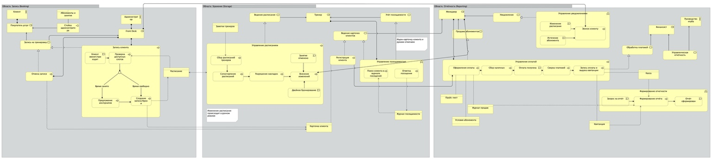
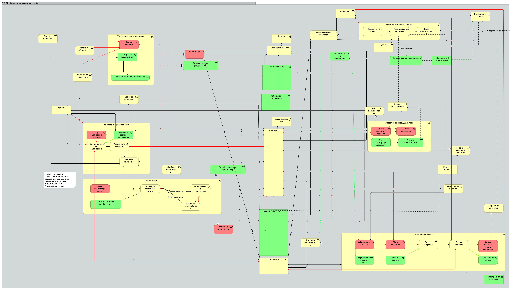
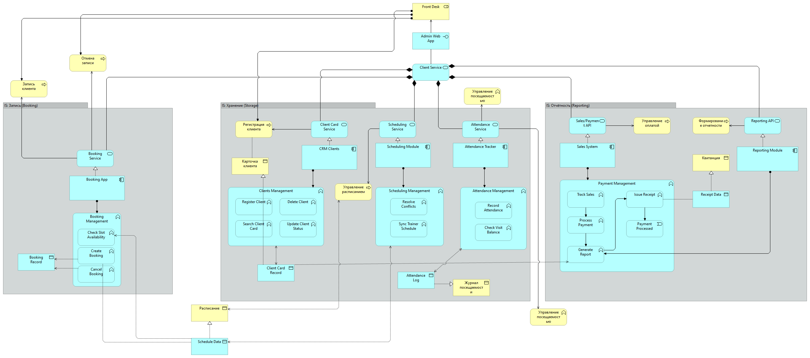
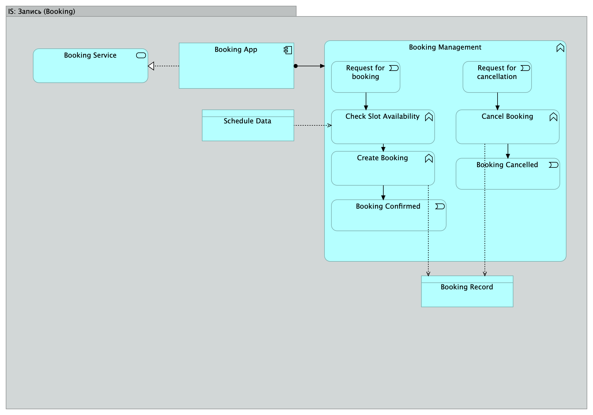
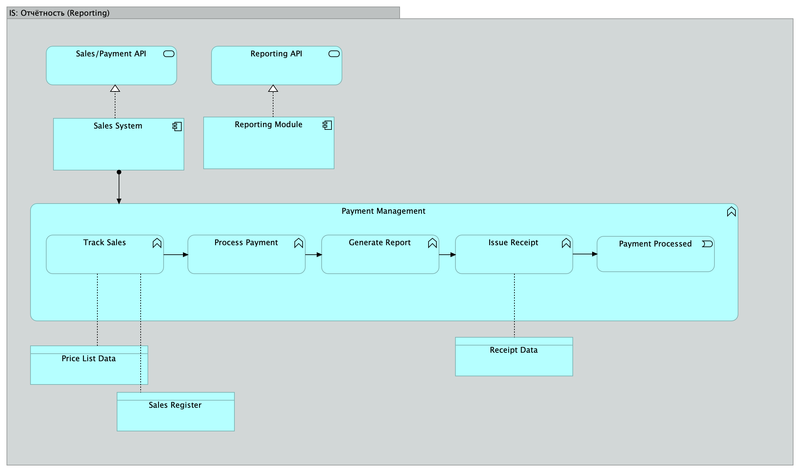
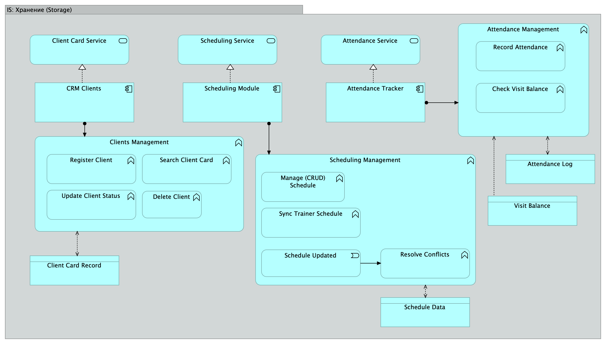
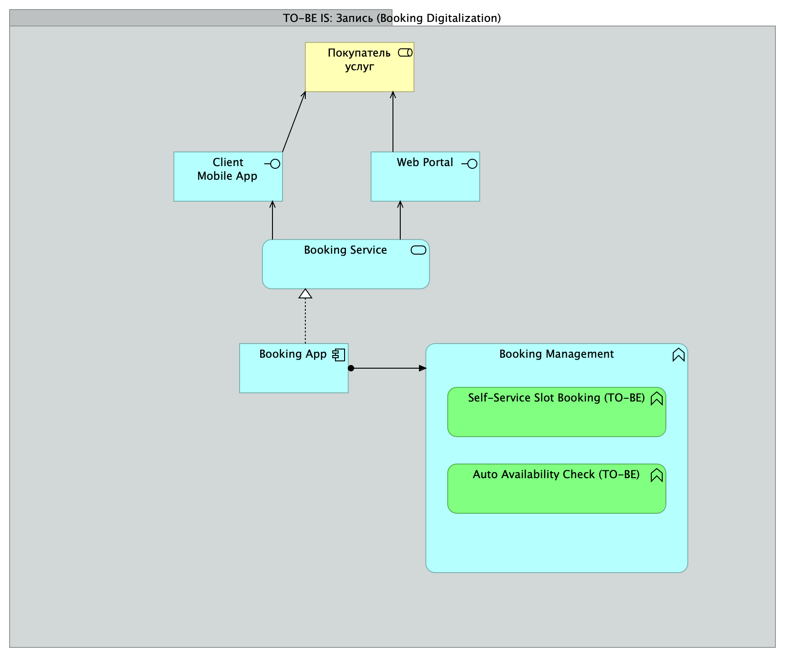
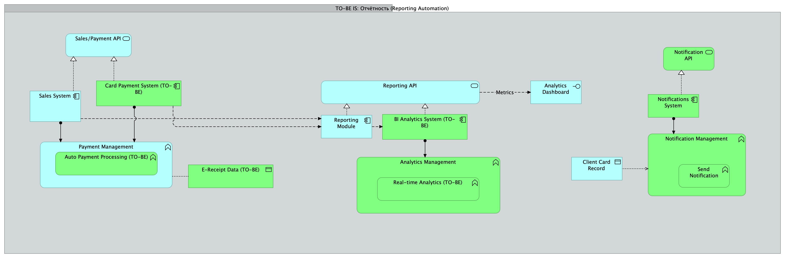
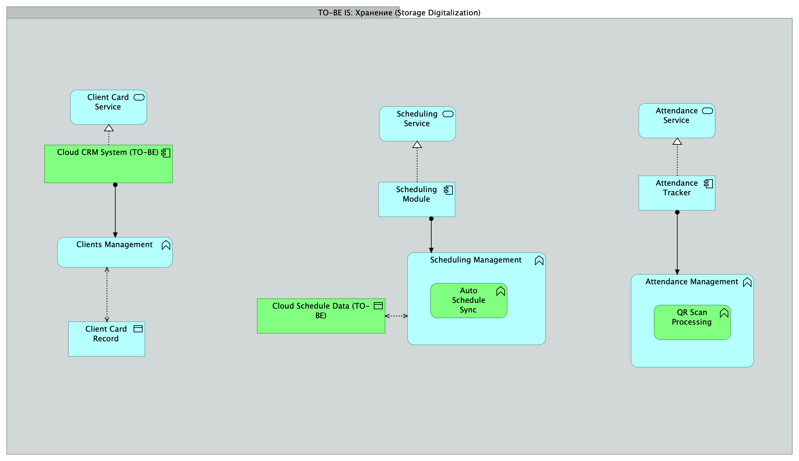

# Задание
[task.pdf](docs/task.pdf)

# Групповой проект: Совершенствование архитектуры предприятия

## Компоненты проекта

Проект должен включать:
- Модель мотивации для целевого состояния
- Архитектуру бизнеса (текущее и целевое состояние)
- Архитектуру информационных систем (текущее и целевое состояние)
- Архитектуру технической инфраструктуры (текущее и целевое состояние)
- Модель перехода из текущего состояния в целевое

---

## Качественные критерии оценки

- Все модели выполнены в одном Archi-файле
- Диаграммы используют **все элементы и связи** ArchiMate
- Диаграммы корректно применяют язык ArchiMate
- Диаграммы логичны по сути и визуально читаемы
- Используется цветовое кодирование для выделения
- Между диаграммами есть прослеживаемые связи

---

## Количественные критерии оценки

- **Модель мотивации:**
    - Одна диаграмма, не менее **70 элементов**

- **Архитектура бизнеса:**
    - Шесть диаграмм (по три для текущего и целевого состояния)
    - В каждой диаграмме не менее **50 элементов**

- **Архитектура информационных систем:**
    - Шесть диаграмм (по три для текущего и целевого состояния)
    - В каждой диаграмме не менее **40 элементов**

- **Архитектура технической инфраструктуры:**
    - Шесть диаграмм (по три для текущего и целевого состояния)
    - В каждой диаграмме не менее **40 элементов**

- **Модель перехода:**
    - Три диаграммы (по одной на каждую область)
    - В каждой диаграмме не менее **30 элементов**

---

## Итоги

- Все диаграммы оформлены в едином стиле и файле
- Использованы все основные инструменты ArchiMate
- Между диаграммами выстроена логика и взаимосвязи

## Ответственные
* Модель мотивации – Александра Пономарева и Сергей Емельянов
* Модели управления клиентами (все уровни, as is и to be) – Александра Пономарева и Сергей Емельянов
* Модели управления тренерами (все уровни, as is и to be) – Валентина Пластинина и Мария Кодзаева
* Модели управления партнерами (все уровни, as is и to be) – Максим Рябинский и Евгений Шмат
* Модели перехода (для всех областей) – Тимур Ермаков

# Проект совершенствования архитектуры ООО "Спорт +", Категория: фитнес-центр, оказание тренерских услуг, тренажерный зал

ООО «Спорт+» — это современный фитнес-центр, специализирующийся на оказании тренерских услуг и организации занятий в тренажёрных залах. Компания ориентирована на клиентов, стремящихся поддерживать здоровье, физическую форму и активный образ жизни. Основные направления деятельности — персональные тренировки, групповые занятия, консультации по питанию и восстановлению, а также внедрение цифровых сервисов для повышения качества обслуживания.

Фитнес-центр активно развивает инфраструктуру: современные тренажёры, профессиональное оборудование, зоны функционального тренинга и комфортабельные раздевалки. Однако, несмотря на высокий уровень сервиса, компания столкнулась с типичными для индустрии проблемами — ручное ведение расписаний, низкий уровень автоматизации и отсутствие единой клиентской базы. Это создает сложности в управлении загрузкой залов, взаимодействии с клиентами и формировании оперативной отчётности.

В условиях растущей конкуренции и цифровой трансформации рынка руководство ООО «Спорт+» выбрало стратегию перехода к интегрированной цифровой архитектуре. Основная цель — обеспечить клиентам удобный и прозрачный сервис, а персоналу — инструменты для эффективного управления операциями. Ключевыми направлениями изменений стали внедрение CRM-системы, автоматизация записи и оплаты тренировок, создание мобильного приложения и развитие аналитических инструментов для управленческих решений.

Компания активно инвестирует в IT-инфраструктуру, обучает сотрудников новым технологиям и выстраивает архитектуру бизнеса по международным стандартам ArchiMate и TOGAF. Это позволяет не только оптимизировать внутренние процессы, но и формировать долгосрочное конкурентное преимущество за счёт высокой скорости обслуживания, персонализации предложений и прозрачной аналитики.

В перспективе ООО «Спорт+» видит себя как цифровую фитнес-платформу, объединяющую клиентов, тренеров и менеджмент в единую экосистему. Это позволит компании выйти за рамки классического фитнес-клуба и предложить комплексные wellness-решения, включая онлайн-тренировки, консультации и интеграцию с носимыми устройствами, что укрепит позиции бренда на рынке и обеспечит устойчивое развитие.

# Bussines layer

## Клиенты

### Модель мотивации
Модель отражает мотивационные аспекты цифровой трансформации фитнес-клуба. Она показывает взаимосвязи между стратегическими целями, драйверами изменений, заинтересованными сторонами, ключевыми показателями, ожидаемыми результатами и функциональными требованиями. Основная цель — обеспечение конкурентного преимущества за счёт цифровизации сервисов и повышения эффективности бизнес-процессов.

#### Ключевые элементы модели

1. Заинтересованные стороны (Stakeholders)

* Клиенты фитнес-клуба — конечные пользователи цифровых сервисов.
* Руководство клуба — отвечает за стратегические решения и развитие бизнеса.
* Персонал клуба — использует внутренние инструменты обслуживания.
* IT-отдел — реализует и поддерживает цифровые решения.
* Инвесторы — заинтересованы в росте прибыли.
* Регуляторы — формируют требования к безопасности и отчётности.

2. Драйверы (Drivers)

* Рост конкуренции на рынке.
* Падение клиентской лояльности.
* Требования регуляторов.
* Отсутствие аналитики и устаревшие процессы.
* Эти факторы стимулируют организацию к цифровой трансформации и повышению эффективности обслуживания клиентов.

3. Цели (Goals)

* Рост выручки на 30%.
* Рост числа клиентов на 25%.
* Повышение лояльности клиентов.
* Снижение времени обслуживания в 3 раза.
* Обеспечение конкурентного преимущества.

4. Исходное состояние (Assessment AS-IS)

* Новая клиентская база формируется медленно (60%).
* Высокое время обработки заявок (10 мин).
* Частые ошибки в ручных процессах.

5. Целевое состояние (TO-BE) и показатели

* Ошибок менее 2%.
* Время обработки заявки — не более 2 минут.
* Уровень удовлетворенности клиентов — 90%.

6. Ожидаемые результаты (Outcomes)

* Снижение стоимости обслуживания.
* Повышение производительности сотрудников.
* Прозрачность бизнес-процессов.
* Минимизация ошибок.

7. Архитектурные принципы

* Масштабируемость решений.
* Интеграция с внешними системами
* Использование CRM-системы.
* Доступность аналитических данных для руководства.

8. Функциональные требования

* Онлайн-запись 24/7.
* Мобильное приложение для клиентов.
* Автоматизация учёта посещений
* Отчётность и аналитика для руководства.
* API для интеграции с платёжными системами.

9. Ограничения проекта

* Бюджет: до 5 млн руб.
* Срок реализации: 12 месяцев.
* Обучение персонала — до 2 недель.

10. Ценности для бизнеса

* Удобство для клиента.
* Экономия времени.
* Рост прибыли.
* Упрощение работы персонала.
* Область 1 – управление клиентами

#### Бизнес-слой

Бизнес-слой модели описывает структуру и логику функционирования фитнес-клуба, включая участников, основные процессы и взаимосвязи между ними. Цель модели — отразить, как бизнес-операции реализуют ценностные предложения для клиентов и обеспечивают выполнение стратегических целей, связанных с цифровизацией и повышением эффективности.

Обе модели (AS-IS и TO-BE) построены вокруг трёх ключевых бизнес-областей:

1. Запись клиентов (Booking)

2. Хранение и управление данными (Storage / Management)

3. Отчётность и аналитика (Reporting)

#### 🟡 Текущее состояние (AS-IS): Бизнес-слой фитнес-клуба

Модель текущего состояния отражает, как бизнес-процессы фитнес-клуба функционируют до цифровой трансформации.

Главная особенность — высокая доля ручных операций, низкая интеграция между процессами и отсутствие централизованного управления данными.

Все функции распределены между администраторами, тренерами и менеджерами, при этом клиент вовлечён только в офлайн-взаимодействие.

###### 1. Область “Запись клиентов”

Основные участники: Клиент, Администратор, Front Desk

Описание процессов:

Запись клиента осуществляется вручную через администратора или стойку регистрации.
Проверка доступных слотов и формирование расписания выполняются сотрудником.
При изменениях расписания требуется ручное уведомление клиентов.

###### 2. Область “Хранение и управление данными”

Основные участники: Тренеры, Администраторы, Менеджеры.

Описание процессов:

Учёт посещений ведётся в журналах
Информация о клиентах и абонементах хранится в разных источниках (Excel, CRM, касса).
Изменения в расписании и регистрация клиентов требуют участия нескольких сотрудников.

###### 3. Область “Отчётность и аналитика”

Основные участники: Менеджеры, Финансовый отдел, Руководство клуба.

Описание процессов:

Формирование отчётов выполняется вручную.
Данные собираются из разных систем и журналов.
Отчётность предоставляется с задержками, аналитика минимальна.
Итог по текущему состоянию:

Модель AS-IS показывает, что бизнес-процессы фитнес-клуба сильно зависят от человеческого фактора, разрозненных источников данных и неэффективных коммуникаций.

Это снижает скорость обслуживания, увеличивает затраты и ограничивает управляемость бизнеса.

#### 🟢 Будущее состояние (TO-BE): Цифровизированный бизнес-слой фитнес-клуба

Модель будущего состояния демонстрирует переход к цифрово интегрированной архитектуре, где ключевые операции автоматизированы, а данные централизованы.

Основная цель — создание бесшовного клиентского опыта и автоматизация бизнес-операций через мобильные и онлайн-каналы.

###### 1. Область “Запись клиентов” (Booking)

Ключевые изменения:

Запись клиента теперь выполняется через мобильное приложение и чат-бота.
Клиент самостоятельно выбирает тренера, зал и время, а система автоматически проверяет доступность.
Администратор выполняет только контрольные и корректирующие действия.
Автоматические уведомления информируют клиентов о подтверждении или изменении записи.

###### 2. Область “Хранение и управление данными” (Storage / Management)

Ключевые изменения:

Внедрена централизованная система управления данными: все записи, абонементы и посещения хранятся в едином цифровом пространстве.
Автоматизация процессов управления расписанием:
Сбор расписаний тренеров
Синхронизация с записями клиентов
Разрешение конфликтов расписания
Учёт посещений полностью цифровизирован (через электронные карты, QR-коды или интеграцию с CRM).

###### 3. Область “Отчётность и аналитика” (Reporting & Analytics)

Ключевые изменения:

Автоматическое формирование отчётов: система самостоятельно агрегирует данные о посещениях, продажах, оплатах и загруженности залов.
Финансовый отдел и руководство получают актуальные дашборды с ключевыми показателями.
Запросы на отчёты выполняются в режиме реального времени.
Устранены ручные операции при формировании отчётности.
Общий эффект трансформации

* 📲 Клиент получает единый цифровой канал взаимодействия.

* ⚙️ Персонал освобождается от рутинных задач.

* 💾 Данные становятся единым и достоверным источником.

* 📊 Руководство получает прозрачную аналитику и отчётность.

* 💡 Организация переходит от ручного управления к автоматизированной цифровой экосистеме.

# Application (IS) layer

## Application Layer (IS): AS-IS для клиентов фитнес-клуба «Спорт+»

## AS IS

## 🎯 Общая структура
В текущем состоянии (AS-IS) ИТ-архитектура фитнес-клуба фрагментирована:  
каждая бизнес-область (запись, хранение данных, отчётность) использует отдельные приложения и файлы без централизованного взаимодействия.  
Нет сквозной интеграции, автоматизации и единого пользовательского интерфейса.

---

## 1. 📘 Область «Запись» (Booking)
**Основное приложение:** Booking App  
**Подсистемы:**  
- **Booking Service** — базовый сервис записи клиентов.  
- **Auth Service / Authentication API** — ручная авторизация клиентов и сотрудников.  

**Функции:**  
- Проверка слотов в расписании (по запросу администратора).  
- Ручное создание, подтверждение или отмена брони.  
- Ведение локального **Booking Record** (без синхронизации с другими системами).

**Проблемы:**  
- Отсутствие онлайн-записи.  
- Ручная проверка расписания.  
- Нет связи с CRM или системой посещаемости.

---

## 2. 🗂 Область «Хранение» (Storage)
**Основное приложение:** CRM Clients  
**Подсистемы:**  
- **Client Card Service** — карточки клиентов в локальной CRM.  
- **Scheduling Module** — расписание тренеров и залов.  
- **Attendance Tracker** — журнал посещений.

**Функции:**  
- Регистрация клиентов и хранение базовых данных.  
- Управление расписанием и разрешение конфликтов вручную.  
- Учёт посещаемости (вручную через Attendance Log).  

**Проблемы:**  
- Разрозненность данных.  
- Нет синхронизации между клиентскими, расписательными и платёжными системами.  
- Зависимость от администратора для обновления информации.

---

## 3. 📊 Область «Отчётность» (Reporting)
**Основное приложение:** Sales System  
**Подсистемы:**  
- **Reporting Module** — отчётность и финансы.  
- **Sales/Payment API** — ручная выгрузка данных о продажах.  

**Функции:**  
- Учёт продаж и оплат (вручную через кассу или Excel).  
- Генерация отчётов с задержками.  
- Формирование квитанций и финансовых сводок.  

**Проблемы:**  
- Нет связи с реальными данными посещаемости.  
- Отчёты строятся вручную.  
- Нет аналитики и визуальных панелей.

---

## 4. 🧩 Интеграционная схема (AS-IS Integration)
**Admin Web App** — основной интерфейс администратора, объединяющий частично Booking, CRM и Reporting.  
Связи с другими сервисами:
- Через устаревшие API или ручные операции (экспорт CSV/Excel).  
- Отсутствует единый слой интеграции.  
- Пользовательский интерфейс доступен только персоналу (клиент не имеет онлайн-доступа).

---

## ⚠️ Итог AS-IS Application Layer

| Компонент | Назначение | Тип связи | Проблема |
|------------|-------------|------------|-----------|
| Booking App | Запись клиентов | Ручная | Нет онлайн-функционала |
| CRM Clients | Хранение данных | Локальная база | Несогласованные данные |
| Sales System | Учёт продаж | Автономная | Нет связи с CRM |
| Reporting Module | Финансовые отчёты | Полуручная | Нет дашбордов |
| Attendance Tracker | Учёт посещений | Изолированный | Не интегрирован с CRM |
| Admin Web App | Интерфейс администратора | Частичная интеграция | Нет доступа клиента |

**Вывод:**  
Текущий уровень автоматизации — минимальный.  
Архитектура построена на изолированных модулях без единого центра управления.  
Все ключевые операции (запись, учёт, отчётность) выполняются вручную.  
Клиент не вовлечён в систему — взаимодействие осуществляется только через администратора.

## Application Layer (IS): TO-BE для клиентов фитнес-клуба «Спорт+»

## 🎯 Общая структура
Целевая архитектура (TO-BE) демонстрирует переход к цифровой экосистеме, где все модули связаны через API и работают в режиме реального времени.  
Ключевая цель — **автоматизация записи, хранения данных, учёта посещений и отчётности**, с фокусом на самообслуживании клиентов и аналитике для руководства.

---

## 1. 📘 Область «Запись» (Booking Digitalization)
**Основные компоненты:**
- **Client Mobile App** — мобильное приложение для клиентов.  
- **Web Portal** — веб-доступ для бронирования через браузер.  
- **Booking Service** — центральный сервис записи.  
- **Booking App** — интерфейс администратора и внутренней работы.  
- **Booking Management (TO-BE)**:
  - **Self-Service Slot Booking (TO-BE)** — самостоятельная онлайн-запись клиента.
  - **Auto Availability Check (TO-BE)** — автоматическая проверка доступных слотов.

**Сценарий взаимодействия:**
1. Клиент выбирает услугу и время через мобильное приложение или веб-портал.  
2. Система автоматически проверяет свободные слоты и формирует бронь.  
3. Администратор получает уведомление и контролирует исключения.  
4. Данные о записи синхронизируются с календарём тренеров и CRM.  

**Результат:**  
Клиент самостоятельно управляет своими записями 24/7, а процесс записи стал бесконтактным и автоматизированным.

---

## 2. 🗂 Область «Хранение» (Storage Digitalization)
**Основные компоненты:**
- **Cloud CRM System (TO-BE)** — облачная CRM для централизованного хранения клиентских данных.  
- **Client Card Service** — сервис клиентских карточек.  
- **Scheduling Module / Scheduling Management (TO-BE)**:
  - **Auto Schedule Sync (TO-BE)** — автоматическая синхронизация расписаний тренеров и залов.  
- **Attendance Tracker / Attendance Management (TO-BE)**:
  - **QR Scan Processing (TO-BE)** — автоматическая регистрация посещений через QR-коды.  
- **Cloud Schedule Data (TO-BE)** — единая облачная база данных расписаний.

**Сценарий взаимодействия:**
1. Все клиентские данные хранятся в облачной CRM.  
2. Расписание и записи синхронизируются в облаке между тренерами, залами и клиентами.  
3. Клиент отмечает посещение через QR-код — система автоматически обновляет баланс посещений.  

**Результат:**  
Единая база клиентов и расписаний исключает дублирование данных, минимизирует ошибки и ускоряет взаимодействие между участниками.

---

## 3. 📊 Область «Отчётность» (Reporting Automation)
**Основные компоненты:**
- **Sales System / Card Payment System (TO-BE)** — автоматизированная обработка платежей.  
- **Payment Management (TO-BE)**:
  - **Auto Payment Processing (TO-BE)** — автоматическое проведение платежей.  
- **Reporting Module / BI Analytics System (TO-BE)** — модуль бизнес-аналитики и визуализации.  
- **Analytics Management (TO-BE)**:
  - **Real-Time Analytics (TO-BE)** — аналитика и метрики в реальном времени.  
- **Notification System / Notification API (TO-BE)** — автоматическая отправка уведомлений клиентам и менеджерам.

**Сценарий взаимодействия:**
1. При оплате система автоматически фиксирует транзакцию и генерирует электронный чек (**E-Receipt Data**).  
2. BI-модуль агрегирует данные из CRM, расписания и финансовых систем.  
3. Руководство получает дашборды с показателями продаж, загрузки залов и удержания клиентов.  
4. Система уведомлений рассылает оповещения клиентам о платежах, продлениях и акциях.  

**Результат:**  
Отчётность стала автоматической, без ручной обработки, с визуализацией ключевых метрик в режиме реального времени.

---

## 4. 🧩 Интеграционная схема (TO-BE Integrated Architecture)
**Основные компоненты:**
- **Client Mobile App / Web Portal** — единые клиентские каналы.  
- **Booking, CRM, Attendance, Sales и Reporting** — связаны через API.  
- **Notifications System (TO-BE)** — обеспечивает связь между событиями и пользователями.  
- **Analytics Dashboard** — отображает интегрированные данные (записи, платежи, посещаемость).  

**Ключевые улучшения:**
- Сквозная интеграция между всеми сервисами.  
- Работа с единой базой клиентов и расписаний.  
- Уведомления и отчётность работают автоматически без участия сотрудников.  
- Администратор и руководство видят актуальные данные в реальном времени.  

---

## ⚙️ Результаты трансформации Application Layer

| Компонент | Новая функция | Эффект |
|------------|----------------|---------|
| Client Mobile App | Онлайн-запись и оплата | Самообслуживание клиента |
| Cloud CRM System | Централизованное хранилище | Единые клиентские данные |
| Scheduling Module | Автосинхронизация расписаний | Минимум ошибок и накладок |
| Attendance Tracker | QR-регистрация | Без ручных отметок |
| Payment System | Автоматическая обработка | Ускорение финансового учёта |
| BI Analytics System | Аналитика в реальном времени | Прозрачность управленческих данных |
| Notification System | Автоматические уведомления | Улучшение коммуникаций |

---

## ✅ Вывод
Архитектура **TO-BE Application Layer** превращает изолированные приложения в связанную экосистему:  
- Клиент управляет взаимодействием самостоятельно;  
- CRM, расписание и финансы работают синхронно;  
- Отчётность и уведомления формируются автоматически;  
- Руководство получает прозрачную аналитику и контроль в реальном времени.
